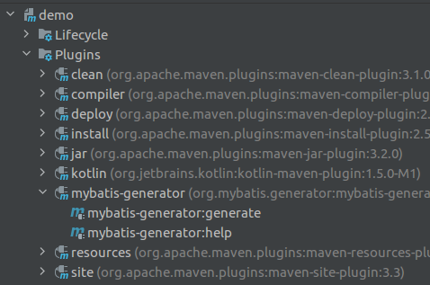

# Mybatis Dynamic SQL~~真香~~使用

在看litemall源码的时候看到还在使用mybatis，然后就在查找使用方法，发现水有深，一直以为本项目使用的技术是前沿的，但、、、

[真香MYBATIS请参考这里 - 干掉mapper.xml！MyBatis新特性动态SQL真香！](https://segmentfault.com/a/1190000038861612)

我还是喜欢使用`jpa`，接下来记录一下`1.4.0`的新使用方法

# 香

## 添加库包
```html

        <dependency>
            <groupId>mysql</groupId>
            <artifactId>mysql-connector-java</artifactId>
            <version>8.0.23</version>
        </dependency>

        <dependency>
            <groupId>org.mybatis.spring.boot</groupId>
            <artifactId>mybatis-spring-boot-starter</artifactId>
            <version>2.1.4</version>
        </dependency>
        <dependency>
            <groupId>org.mybatis.dynamic-sql</groupId>
            <artifactId>mybatis-dynamic-sql</artifactId>
            <version>1.2.1</version>
        </dependency>
        <dependency>
            <groupId>org.mybatis.generator</groupId>
            <artifactId>mybatis-generator-core</artifactId>
            <version>1.4.0</version>
            <scope>provided</scope>
        </dependency>
```

```html

            <plugin>
                <groupId>org.mybatis.generator</groupId>
                <artifactId>mybatis-generator-maven-plugin</artifactId>
                <version>1.4.0</version>

                <configuration>
                    <configurationFile>src/main/resources/mybatis-generator.xml</configurationFile>
                    <overwrite>true</overwrite>
                </configuration>
                <dependencies>
                    <dependency>
                        <groupId>mysql</groupId>
                        <artifactId>mysql-connector-java</artifactId>
                        <scope>runtime</scope>
                        <version>8.0.23</version>
                    </dependency>
                </dependencies>
            </plugin>
```

## 配置
在`resources/mybatis-generator.xml`中添加好需要映射的`mapper`目录
```xml
<!DOCTYPE generatorConfiguration PUBLIC
        "-//mybatis.org//DTD MyBatis Generator Configuration 1.0//EN"
        "http://mybatis.org/dtd/mybatis-generator-config_1_0.dtd">
<generatorConfiguration>
    <properties resource="generator.properties"/>
    <context id="MySql" targetRuntime="MyBatis3DynamicSQL">

        <property name="beginningDelimiter" value="`"/>
        <property name="endingDelimiter" value="`"/>
        <property name="javaFileEncoding" value="UTF-8"/>
        <!-- 为模型生成序列化方法-->
        <plugin type="org.mybatis.generator.plugins.SerializablePlugin"/>
        <!-- 为生成的Java模型创建一个toString方法 -->
        <plugin type="org.mybatis.generator.plugins.ToStringPlugin"/>
<!--
        &lt;!&ndash;可以自定义生成model的代码注释&ndash;&gt;
        <commentGenerator type="com.example.demo.mbg.CommentGenerator">
            &lt;!&ndash; 是否去除自动生成的注释 true：是 ： false:否 &ndash;&gt;
            <property name="suppressAllComments" value="true"/>
            <property name="suppressDate" value="true"/>
            <property name="addRemarkComments" value="true"/>
        </commentGenerator>
-->
        <!--配置数据库连接-->
        <jdbcConnection driverClass="${jdbc.driverClass}"
                        connectionURL="${jdbc.connectionURL}"
                        userId="${jdbc.userId}"
                        password="${jdbc.password}">
            <!--解决mysql驱动升级到8.0后不生成指定数据库代码的问题-->
            <property name="nullCatalogMeansCurrent" value="true"/>
        </jdbcConnection>

        <!--指定生成model的路径-->
        <javaModelGenerator targetPackage="com.example.demo.mbg.model"
                            targetProject="src/main/java"/>

        <!--指定生成mapper接口的的路径-->
        <javaClientGenerator targetPackage="com.example.demo.mbg.dao"
                             targetProject="src/main/java" type="XMLMAPPER"/>
        <!--生成全部表tableName设为%-->
        <table tableName="%">
            <generatedKey column="id" sqlStatement="MySql" identity="true"/>
        </table>
    </context>

</generatorConfiguration>
```

## Generate

点击`mybatis-generator:generate`生成`mapper`




# references

https://segmentfault.com/a/1190000038861612
https://mp.weixin.qq.com/s/ehe7Ub5RAYAql_oPZmerAQ
https://github.com/macrozheng/mall-learning/blob/master/mall-tiny-dynamic-sql/src/main/java/com/macro/mall/tiny/mbg/CommentGenerator.java
https://mybatis.org/mybatis-dynamic-sql/docs/conditions.html
