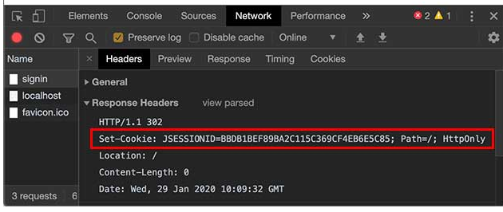

# 使用Session和Cookie

在Web应用程序中，我们经常要跟踪用户身份。当一个用户登录成功后，如果他继续访问其他页面，Web程序如何才能识别出该用户身份？

因为HTTP协议是一个无状态协议，即Web应用程序无法区分收到的两个HTTP请求是否是同一个浏览器发出的。为了跟踪用户状态，服务器可以向浏览器分配一个唯一ID，并以Cookie的形式发送到浏览器，浏览器在后续访问时总是附带此Cookie，这样，服务器就可以识别用户身份。

## Session
我们把这种基于唯一ID识别用户身份的机制称为Session。每个用户第一次访问服务器后，会自动获得一个Session ID。如果用户在一段时间内没有访问服务器，那么Session会自动失效，下次即使带着上次分配的Session ID访问，服务器也认为这是一个新用户，会分配新的Session ID。

JavaEE的Servlet机制内建了对Session的支持。我们以登录为例，当一个用户登录成功后，我们就可以把这个用户的名字放入一个HttpSession对象，以便后续访问其他页面的时候，能直接从HttpSession取出用户名：


```
    private String doKaptcha(HttpServletRequest request) {
        String text = kaptchaProducer.createText();
        BufferedImage image = kaptchaProducer.createImage(text);
        HttpSession session = request.getSession();
        session.setAttribute("kaptcha", text);
```

```
    public Object login(@RequestBody String body, HttpServletRequest request) {
        HttpSession session = request.getSession();
        String kaptcha = (String)session.getAttribute("kaptcha");
        // session.removeAttribute("kaptcha");
```

对于Web应用程序来说，我们总是通过HttpSession这个高级接口访问当前Session。如果要深入理解Session原理，可以认为Web服务器在内存中自动维护了一个ID到HttpSession的映射表，我们可以用下图表示：

```
           ┌ ─ ─ ─ ─ ─ ─ ─ ─ ─ ─ ─ ─ ─ ─ ─ ─ ─ ─ ─ ┐

           │      ┌───────────────┐                │
             ┌───>│ IndexServlet  │<──────────┐
           │ │    └───────────────┘           ▼    │
┌───────┐    │    ┌───────────────┐      ┌────────┐
│Browser│──┼─┼───>│ SignInServlet │<────>│Sessions││
└───────┘    │    └───────────────┘      └────────┘
           │ │    ┌───────────────┐           ▲    │
             └───>│SignOutServlet │<──────────┘
           │      └───────────────┘                │

           └ ─ ─ ─ ─ ─ ─ ─ ─ ─ ─ ─ ─ ─ ─ ─ ─ ─ ─ ─ ┘

```

而服务器识别Session的关键就是依靠一个名为JSESSIONID的Cookie。在Servlet中第一次调用req.getSession()时，Servlet容器自动创建一个Session ID，然后通过一个名为JSESSIONID的Cookie发送给浏览器：



这里要注意的几点是：

- JSESSIONID是由Servlet容器自动创建的，目的是维护一个浏览器会话，它和我们的登录逻辑没有关系；
- 登录和登出的业务逻辑是我们自己根据HttpSession是否存在一个"user"的Key判断的，登出后，Session ID并不会改变；
- 即使没有登录功能，仍然可以使用HttpSession追踪用户，例如，放入一些用户配置信息等。
- 除了使用Cookie机制可以实现Session外，还可以通过隐藏表单、URL末尾附加ID来追踪Session。这些机制很少使用，最常用的Session机制仍然是Cookie。
- 使用Session时，由于服务器把所有用户的Session都存储在内存中，如果遇到内存不足的情况，就需要把部分不活动的Session序列化到磁盘上，这会大大降低服务器的运行效率，因此，放入Session的对象要小

在使用多台服务器构成集群时，使用Session会遇到一些额外的问题。通常，多台服务器集群使用反向代理作为网站入口：

如果多台Web Server采用无状态集群，那么反向代理总是以轮询方式将请求依次转发给每台Web Server，这会造成一个用户在Web Server 1存储的Session信息，在Web Server 2和3上并不存在，即从Web Server 1登录后，如果后续请求被转发到Web Server 2或3，那么用户看到的仍然是未登录状态。

要解决这个问题，方案一是在所有Web Server之间进行Session复制，但这样会严重消耗网络带宽，并且，每个Web Server的内存均存储所有用户的Session，内存使用率很低。

另一个方案是采用粘滞会话（Sticky Session）机制，即反向代理在转发请求的时候，总是根据JSESSIONID的值判断，相同的JSESSIONID总是转发到固定的Web Server，但这需要反向代理的支持。

无论采用何种方案，使用Session机制，会使得Web Server的集群很难扩展，因此，**Session适用于中小型Web应用程序。对于大型Web应用程序来说，通常需要避免使用Session机制。**

## Cookie

实际上，Servlet提供的`HttpSession`本质上就是通过一个名为`JSESSIONID`的`Cookie`来跟踪用户会话的。除了这个名称外，其他名称的Cookie我们可以任意使用。

```
    private static final Set<String> LANGUAGES = Set.of("en", "zh");

    protected void doGet(HttpServletRequest req, HttpServletResponse resp) throws ServletException, IOException {
        String lang = req.getParameter("lang");
        if (LANGUAGES.contains(lang)) {
            // 创建一个新的Cookie:
            Cookie cookie = new Cookie("lang", lang);
            // 该Cookie生效的路径范围:
            cookie.setPath("/");
            // 该Cookie有效期:
            cookie.setMaxAge(8640000); // 8640000秒=100天
            // 将该Cookie添加到响应:
            resp.addCookie(cookie);
        }
        resp.sendRedirect("/");
    }
```


https://www.liaoxuefeng.com/wiki/1252599548343744/1328768897515553

